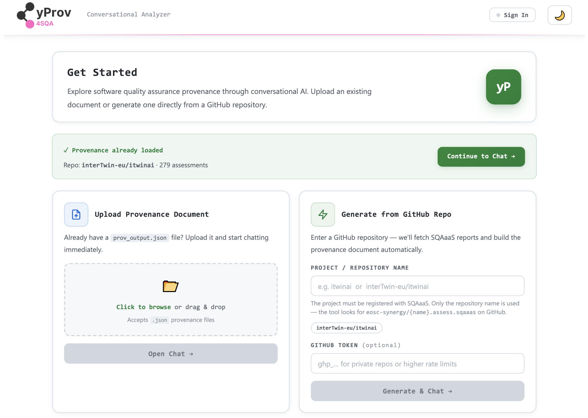
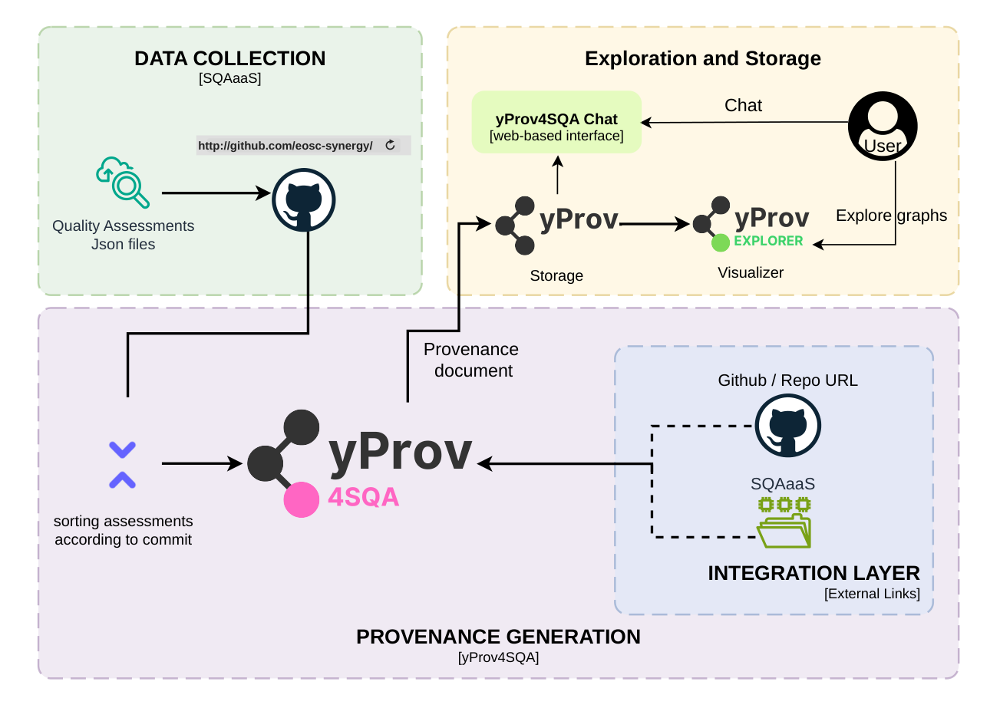
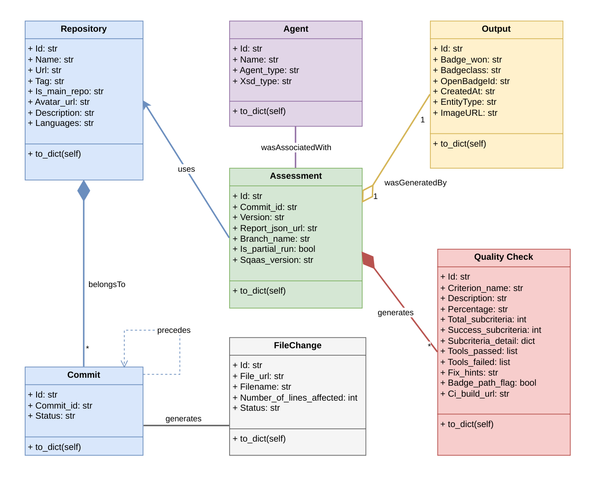
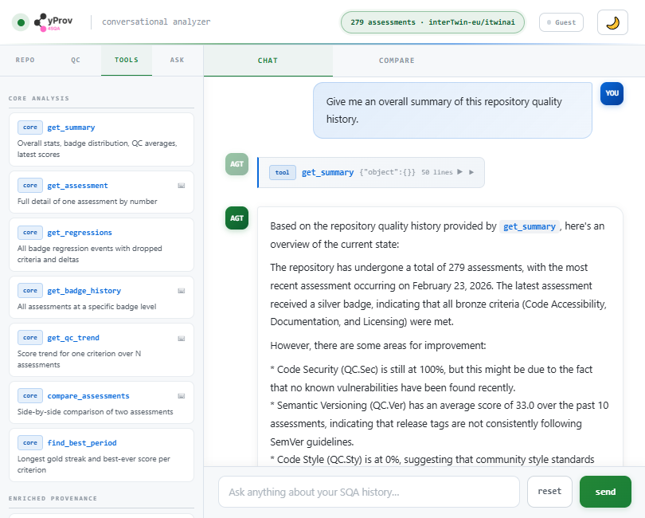
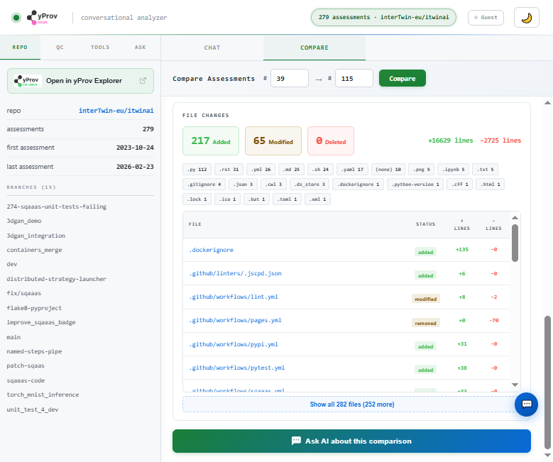

<div align="center">
  <a href="https://github.com/HPCI-Lab">
    
  </a>

  <h3 align="center">yProv4SQA</h3>

  <p align="center">
    A provenance-based framework for traceability in Software Quality Assurance pipelines — tracking the evolution of software quality over time using W3C PROV-compliant documents.
    <br />
    <a href="https://github.com/HPCI-Lab/yProv4SQA/tree/main/docs"><strong>Explore the docs »</strong></a>
    <br />
    <br />
    <a href="https://github.com/HPCI-Lab/yProv4SQA/issues/new?labels=bug&template=bug-report---.md">Report Bug</a>
    &middot;
    <a href="https://github.com/HPCI-Lab/yProv4SQA/issues/new?labels=enhancement&template=feature-request---.md">Request Feature</a>
  </p>
</div>

<br />

<div align="center">

[](https://github.com/HPCI-Lab/yProv4SQA/graphs/contributors)
[](https://github.com/HPCI-Lab/yProv4SQA/network/members)
[](https://github.com/HPCI-Lab/yProv4SQA/stargazers)
[](https://github.com/HPCI-Lab/yProv4SQA/issues)
[](https://opensource.org/licenses/)

</div>

This library is part of the yProv suite, and provides a provenance-based architecture for traceability in Software Quality Assurance (SQA) pipelines. It integrates with [SQAaaS](https://docs.sqaaas.eosc-synergy.eu/) to collect quality assessment reports and generate W3C PROV-compliant provenance documents that capture the full quality evolution of a software project over time.

It allows users to generate provenance graphs, compare any two assessments at the commit level, publish documents to [yProvStore](http://yprov.disi.unitn.it:8000), visualize them in [yProvExplorer](https://explorer.yprov.disi.unitn.it), and interact with the provenance data through a conversational AI agent.

## Overview



## Architecture



## Provenance Graph (Level-1)


## Commit Comparison (Level-2)


## Data Model



## Chat Agent



## Compare Assessments



## Quick Example

```bash
# 1 — fetch SQAaaS assessment reports from GitHub
fetch-sqa-reports itwinai

# 2 — generate a Level-1 provenance document (full quality history)
process-provenance ./itwinai_SQAaaS_reports

# 3 — compare two assessments (generates a Level-2 provenance document)
compare ./Provenance_documents/interTwin-eu_itwinai_prov_output.json 59 87

# 4 — chat with your provenance data
prov-chat ./Provenance_documents/interTwin-eu_itwinai_prov_output.json --web --port 5000
```

Open [http://localhost:5000](http://localhost:5000) in your browser.

## What it does

- **Fetches** SQAaaS assessment reports from the EOSC-Synergy GitHub space
- **Generates Level-1 provenance documents** — full quality history of a repository, W3C PROV compliant
- **Generates Level-2 provenance documents** — commit-level diff between any two assessments, with direct links to GitHub diffs and SQAaaS reports
- **Visualizes** provenance graphs using the PROV library (SVG) or yProvExplorer (interactive)
- **Publishes** provenance documents to yProvStore for persistent storage and sharing
- **Chat agent** — ask natural language questions about your provenance data using a local (Ollama) or cloud (Google Gemini) LLM

# Documentation

For detailed information, please refer to the [Documentation](https://github.com/HPCI-Lab/yProv4SQA/tree/main/docs).

# Contributors

- [Hafiz Muhammad Yousaf](https://github.com/Yousaf95)
