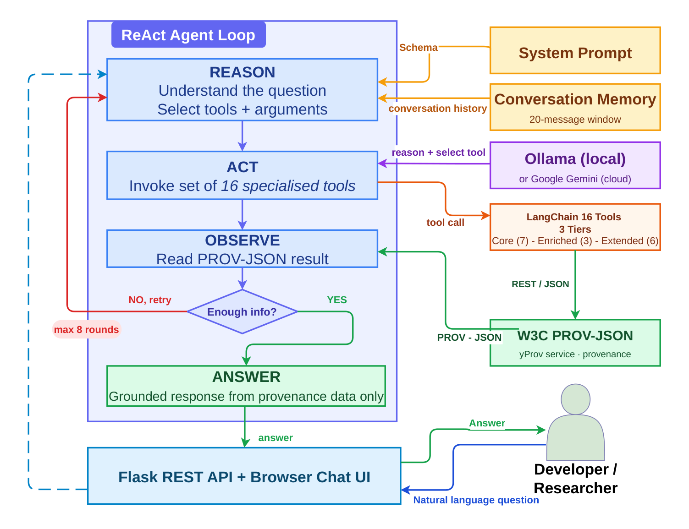

# Conversational Chat Agent

yProv4SQA includes a local-first agentic chat interface. Ask natural language questions about your provenance data. The LLM never sees the raw JSON — it calls structured tools that query the data and returns grounded answers.

**Stack:** Ollama (default) · optional Google Gemini · LangChain · Flask

---

## Launch the web UI

```bash
prov-chat ./Provenance_documents/interTwin-eu_itwinai_prov_output.json --web --port 5000
```

Open [http://localhost:5000](http://localhost:5000) in your browser.


---

## Landing page options

From the landing page you can:

1. **Upload** an existing provenance JSON file
2. **Generate** provenance on the fly by entering a repository name
3. **Load** a previously saved provenance file from disk

---

## Chat interface

Once a provenance document is loaded, the chat interface opens.


## Compare Tab


Example questions you can ask:

- *"What is the current quality badge?"*
- *"When did we first reach gold?"*
- *"What caused the regression in assessment #247?"*
- *"Compare assessments 59 and 87"*
- *"Which QC criterion has been declining over the last 30 assessments?"*

---

## LLM options

### Ollama (default — local, no internet required)

```bash
prov-chat prov_output.json --web --model llama3.2
prov-chat prov_output.json --web --model qwen2.5
```

| Model | Size | Speed | Notes |
|-------|------|-------|-------|
| `llama3.2` | 3B | fast (~15s) | recommended default |
| `llama3.1:8b` | 8B | medium (~30s) | better reasoning |
| `qwen2.5` | 7B | medium | better structured tool calling |
| `qwen2.5:3b` | 3B | fast | works on 8 GB RAM |

### Google Gemini (cloud)

```bash
export GOOGLE_API_KEY=<your_key>
prov-chat prov_output.json --web --provider google --model gemini-2.0-flash
```

---

## Agentic Architecture



## How the agentic loop works

```
Your question
    │
    ▼
LangChain AgentExecutor
(LLM sees only tool schemas — never raw provenance JSON)
    │
    ▼  decides which tool to call
Tool function queries prov_output.json directly
    │
    ▼  returns structured JSON result
LLM reasons over result — may call more tools
    │
    ▼
Final answer grounded in real provenance data
```

See [Tools Reference](tools_reference.md) for the full list of tools.

---

## Example session

```
You: What caused the latest regression?

  ▶ get_regressions
  {"total": 12, "regressions": [..., {"assessment": 247,
    "from_badge": "gold", "to_badge": "silver",
    "dropped_criteria": ["QC.Sty", "QC.Uni"], ...}]}

  ▶ compare_assessments "246,247"
  {"badge_change": "gold → silver",
   "degraded": ["QC.Sty", "QC.Uni"],
   "qc_changes": {"QC.Sty": {"from": 100, "to": 0, "delta": -100}, ...}}

Agent: The latest regression occurred at assessment #247 (2025-09-16).
Both QC.Sty (code style) and QC.Uni (unit testing) dropped from 100%
to 0%, causing the badge to fall from gold to silver.
```
