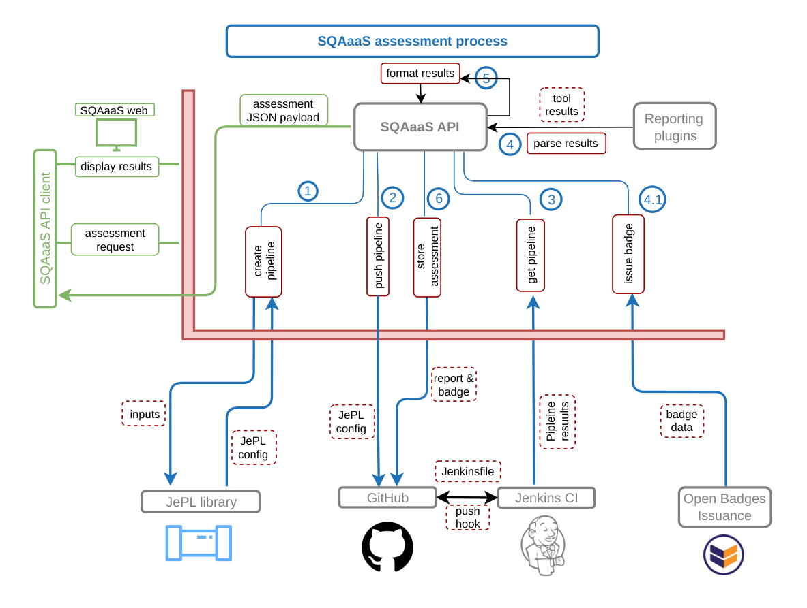
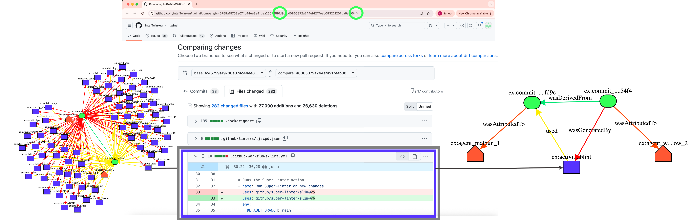

# Quickstart

This guide walks you through the full workflow: fetching reports, generating provenance, comparing assessments, and visualizing the graph.

---

## SQAaaS Pipeline Overview



---

## Step 1 — Fetch SQAaaS reports

```bash
fetch-sqa-reports itwinai
```

This downloads all SQAaaS assessment reports for the `itwinai` repository from the [EOSC-Synergy GitHub space](https://github.com/EOSC-synergy). The output is saved to `./itwinai_SQAaaS_reports/`.

> **Tip:** This may take a few minutes for large repositories. Use a GitHub token (see [Installation](installation.md)) to avoid rate limits.

---

## Step 2 — Generate a Level-1 provenance document

```bash
process-provenance ./itwinai_SQAaaS_reports
```

Output: `./Provenance_documents/interTwin-eu_itwinai_prov_output.json`

This is your **Level-1 provenance document** — a full quality history of the repository, W3C PROV compliant.

---

## Step 3 — Compare two assessments (Level-2)

```bash
compare ./Provenance_documents/interTwin-eu_itwinai_prov_output.json 59 87
```

Output: `./Compare_commit_provenance/itwinai_commit_provenance_<hash>_to_<hash>.json`

This generates a **Level-2 provenance document** capturing file-level changes between assessments #59 and #87, with direct links to the GitHub diff and SQAaaS reports.



---

## Step 4 — Visualize as a graph

```bash
json2graph ./Provenance_documents/interTwin-eu_itwinai_prov_output.json
```

Output: `./Graph_outputs/<filename>.svg`

> Requires GraphViz — see [Installation](installation.md).

---

## Step 5 — Explore in yProvExplorer

Upload the generated JSON to [yProvExplorer](https://explorer.yprov.disi.unitn.it/) for an interactive graph view, or use the yProvStore integration in the web UI — see [yProvStore & Explorer](yprovstore.md).

---

## Pre-built examples

We have already uploaded the graphs used in our paper to yProvStore. Open them directly in yProvExplorer:

- **Level-1 — full assessment history of itwinai (Fig. 5):**  
  [View Graph](https://explorer.yprov.disi.unitn.it/?file=http%3A%2F%2Fyprov.disi.unitn.it%3A3000%2Fapi%2Fv0%2Fdocuments%2Fitwinai)

- **Level-2 — file changes between two assessments (Fig. 7):**  
  [View Graph](https://explorer.yprov.disi.unitn.it/?file=http%3A%2F%2Fyprov.disi.unitn.it%3A3000%2Fapi%2Fv0%2Fdocuments%2Fgitdif)
