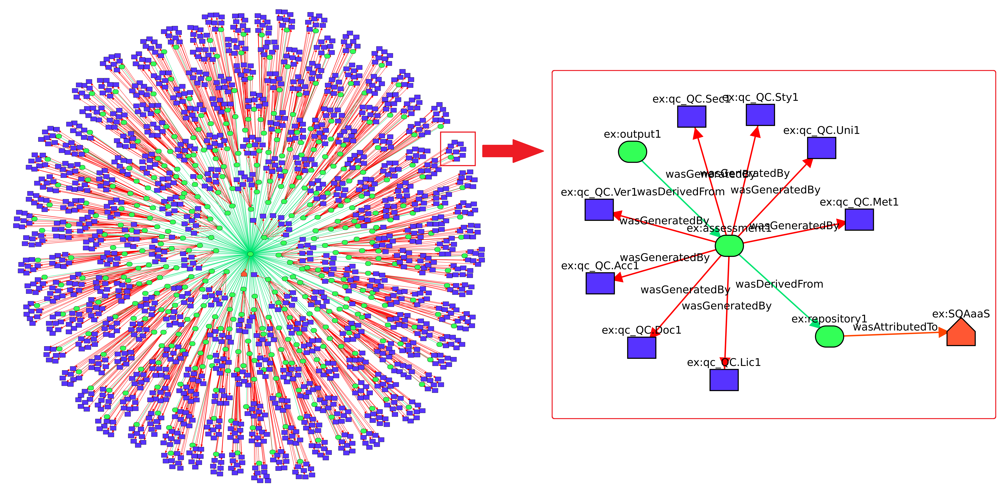

# yProvStore & yProvExplorer

yProvStore is a REST API service for storing W3C PROV provenance documents. yProvExplorer is a web-based tool for visualizing and interacting with those documents as interactive graphs.

| Service | URL |
|---------|-----|
| yProvStore API | http://yprov.disi.unitn.it:8000 |
| yProvExplorer | https://explorer.yprov.disi.unitn.it |

---

## Publishing from the web UI

The yProv4SQA chat UI has built-in yProvStore integration. After loading a provenance document:

1. Click the **Publish** button in the sidebar
2. Log in with your yProvStore account (or sign up)
3. The document is uploaded and you receive a direct **yProvExplorer link**



---

## How the integration works

```
yProv4SQA web UI
    │
    ├─ POST /documents ──────► yProvStore (stores JSON, returns PID)
    │
    └─ explorer_url = yProvExplorer/?file=<storage_url>
                        │
                        └──► yProvExplorer fetches + visualizes the graph
```

The `explorer_url` is constructed automatically — you just click the link after publishing.

---

## Publishing from the command line (yProv v0 API)

If you are running your own yProv instance (see [Running yProv Locally](#running-yprov-locally)):

```bash
# Register
curl -X POST http://localhost:3000/api/v0/auth/register \
  -H 'Content-Type: application/json' \
  -d '{"user": "yourname", "password": "yourpass"}'

# Login — save the token
curl -X POST http://localhost:3000/api/v0/auth/login \
  -H 'Content-Type: application/json' \
  -d '{"user": "yourname", "password": "yourpass"}'

# Upload provenance document
curl -X PUT http://localhost:3000/api/v0/documents/itwinai \
  -H "Content-Type: application/json" \
  -H "Authorization: Bearer <token>" \
  -d @./Provenance_documents/interTwin-eu_itwinai_prov_output.json
```

---

## Running yProv Locally

yProv runs as two Docker containers: the web service + a Neo4j graph database.

```bash
# Create volumes and network
docker volume create neo4j_data
docker volume create neo4j_logs
docker volume create yprov_data
docker network create yprov_net

# Start Neo4j
docker run --name db --network=yprov_net \
  -p 7474:7474 -p 7687:7687 -d \
  -v neo4j_data:/data -v neo4j_logs:/logs \
  --env NEO4J_AUTH=neo4j/password \
  --env NEO4J_ACCEPT_LICENSE_AGREEMENT=eval \
  -e NEO4J_PLUGINS='["apoc"]' \
  neo4j:enterprise

# Start yProv
docker run --name web --network=yprov_net \
  -p 3000:3000 -d \
  -v yprov_data:/app/conf \
  --env USER=neo4j --env PASSWORD=password \
  hpci/yprov:latest
```

Neo4j browser: [http://localhost:7474](http://localhost:7474)  
Login: `neo4j` / `password`

---

## Exploring with Neo4j (Cypher queries)

After uploading a document, select the database in the Neo4j browser and run queries.

**Export quality history (Fig. 6 in the paper):**

```cypher
MATCH (e:Entity)-[:wasGeneratedBy]->(a:Activity)
WHERE a.`ex:percentage` IS NOT NULL
RETURN
   e.`ex:commit_id`   AS CommitID,
   e.`ex:commit_date` AS CommitDate,
   a.`ex:description` AS QualityCriteria,
   a.`ex:percentage`  AS PercentagePassed
ORDER BY e.`ex:commit_date`
```

**Find first bronze and silver badges:**

```cypher
MATCH (bronze:Entity)-[:wasDerivedFrom]->(bronze_ass:Entity)
WHERE bronze.`ex:badge_won` = "bronze"
WITH bronze, bronze_ass ORDER BY bronze_ass.`ex:commit_date` ASC LIMIT 1
MATCH (silver:Entity)-[:wasDerivedFrom]->(silver_ass:Entity)
WHERE silver.`ex:badge_won` = "silver"
WITH bronze, bronze_ass, silver, silver_ass
ORDER BY silver_ass.`ex:commit_date` ASC LIMIT 1
RETURN
  bronze_ass.`ex:commit_id` AS BronzeCommitID,
  bronze_ass.`ex:commit_date` AS BronzeCommitDate,
  silver_ass.`ex:commit_id` AS SilverCommitID,
  silver_ass.`ex:commit_date` AS SilverCommitDate
```
